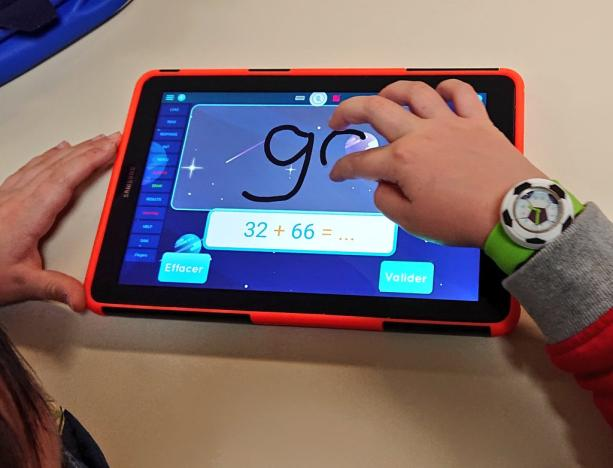
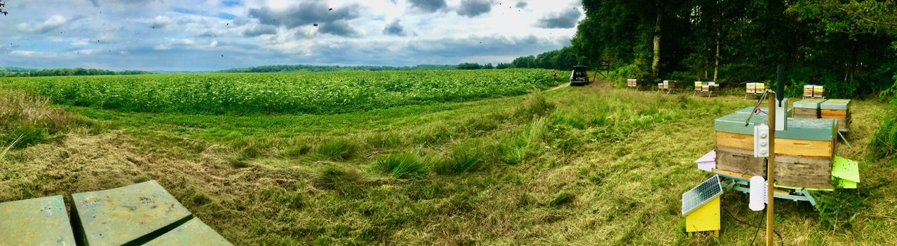

## Industrial projects

We also collaborate with industrial partners to tackle new scientific challenges. These contrats allow to grant new research programs between SMEs and University in one of these two directions: 
 (1) the design of embedded and light AI algorithms or 
 (2) the application of AI for environment purpose.

### Crisis management

[Altanoveo](https://www.cwall.fr/en/) is specialised in very high resolution visualization and has developped for 10 years **CWall**, a high resolution collaborative software solution designed to be deployed on video walls.
CWall is multi-site, multi-source and multi-application. It offers real-time collaboration among people working in the same room or remotely by sharing thier computer screens, video streams,  web application and so on. 
CWall shows its full potential for : 

- joint study of resources at a very high resolution across a wide range of disciplines, 
- simultaneous display of several streams and information into different windows, particularly in crisis management or monitoring situations.

Our main purpose is to integrate AI on Cwall in order to index the vast amount of information encountered crisis.

Based on low consumption algorithms, this project start with an analysis of social networks and open source data as climate crisis images. Being able to summarize open informations and foresee their impact will be a perfect addition upgrade to CWall. 

{:class="img-responsive"}

### AI for Education

The start-up [ProfenPoche](https://profenpoche.com/) was founded in 2015 by Vincent Escudé, Paul Escudé and Samuel Imbert. 
It is specialized in creation on new numerical educative solutions and more specifically, propose to provide a teacher to a needed student using smartphone, tablet or computer. They created **Mathia** using AI as a innovative product in order to give the love of mathematics to children. In 2019, they were rewarded for Mathia as laureate of P2IA (Partenariat d’Innovation en Intelligence Artificielle) launched by the Ministère de l'Education Nationale et de la Jeunesse.

Mathia is an app which recommands educational material to children. The recommendation is powered by a clustering performed on the children profile and which includes their skills and personal difficulties. Our goal is to improve these tasks and reduce the consumption of energies.
{:class="img-responsive"}

### Computer vision and Hydrobiology

[Hizkia Informatique](https://www.hizkia.eu/) is an IT services company. Her experience in computer and video applications for hydrobiology began with INRA (French national institute for agronomic research) more than 15 years ago.
Hizkia designs all its products: hardware and software. It does software development and the installation and maintenance of equipment. Hizkia also has 30 years’ experience in industrial service.

Hizkia has designed a **video-counting device for fish passage**. In the current version, operators have to watch the videos to note the species of fish and their size. Our purpose is to have the videos processed by an AI that would be able to recognize the species of fish, count and measure them automatically. This application of Computer Vision to biodiversity monitoring contains next level challenges : object tracking from frame to frame, denoising images, correct lighting and species labels, and tackle problems of quantization and selection of high resolutions images and videos.

{:class="img-responsive"}

### Improving bee health and pollination

Mellisphera is building data-driven solutions for hive monitoring and pollination management. Founded in 2018, the company offers to beekeepers and growers, tools and algorithms to assess in real time colony health, colony dynamics and pollination activity.

The main benefits of this technology are:
-  Efficient beekeeper’s operations: A constant information stream about the colony health allows for focused actions with the appropriate hardware and at the right time. Savings in time and fuel are significant with a typical ROI < 12 month
-  Lower honeybee mortality rates: A real time alerts system allows beekeepers to be warned when it’s still time for action. We aim reducing mortality from 30% to 10%.
-  Improved pollination and yield: 75% of the fruits we eat are pollinator dependent at some extent. Good pollination is essential for growers achieve yield and quality. Mellisphera monitors pollination on kiwi, sunflower and apple yards. 

Our challenge is to improve beekeeping practices by offering predictive tools that are at the same time accurate and scalable over different regions and countries. To achieve this goal, we are relying on mechanistic and AI powered models. They are developed in our research apiaries as in those from multiple beekeepers contributing around the world. We are partnering with [Broodminder](www.broodminder.com) into a global team with the shared ambition to offer one of the best-in-class solutions.

{:class="img-responsive"}

## Sponsors

This project is mainly supported by the I-Site [E2S-UPPA](https://e2s-uppa.eu/fr/index.html), a french consortium composed of [CNRS](https://www.cnrs.fr/), [INRIA](https://www.inria.fr/), [INRAE](https://www.inrae.fr/) that assists companies and public organizations in their energy and environmental transition.

Partnerships with public institutions, as well as SMEs are one of the main motivations for the existence of GreenAI Uppa. 
 - [Altanoveo](https://www.cwall.fr/)
 - [Aquitaine Science Transfert](https://www.ast-innovations.com/)
 - [Technopole Hélioparc](https://helioparc.fr/)
 - [Mellisphera](https://www.mellisphera.com/)
 - [ORIE, Cornell University](https://www.orie.cornell.edu/orie)
 - [Prof en Poche](https://profenpoche.com/)
 - [Réseau Francilien en Sciences Informatiques (RFSI)](https://dim-rfsi.fr/)
 - [Hizkia Informatique](https://www.hizkia.eu/)