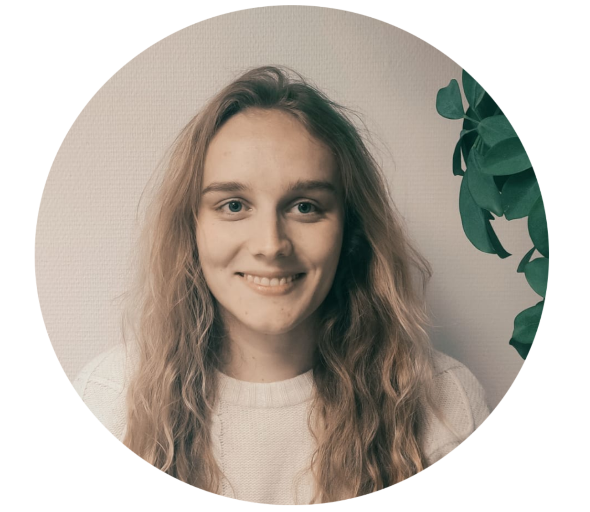
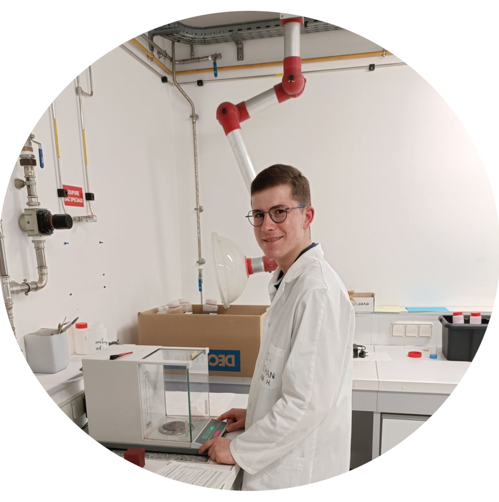
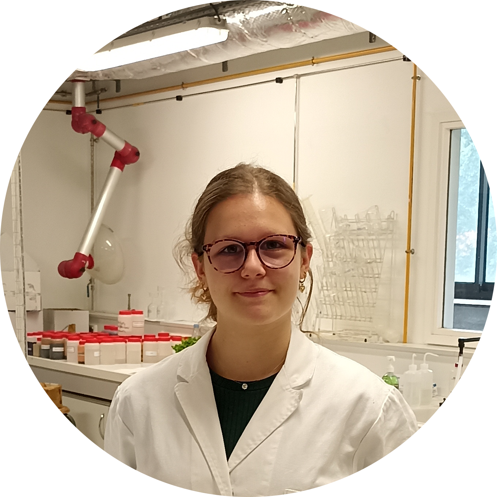

## The team

The GreenAI UPPA team is an engaged lab that improves state-of-the-art machine learning algorithms. Concerned with our impact on earth, we develop low consumption algorithms and tackle environmental challenges. Unlike other research groups, our activities are dedicated to the full pipeline from the math grounding to R&D prototype and in production deployment with industrial partners. We are based in Pau, France, in front of the Pyrénées. 

## Our research

{:class="img-responsive"}

Our research encompasses diverse projects and collaborations around the mathematical foundations of power-efficient deep/machine learning algorithms, and the applications of AI to build a more sustainable world. In this section, we present the mathematical as well as the algorithmic part of our activity. 

## Team members

We wish to bring together different people from different communities but with one share commitment: take collective actions on the world's greatest crisis and build a safe and healthy planet for the next generations.

### Sébastien Loustau

After a PHD thesis defended in 2008, at [Institut de Marseille](https://www.i2m.univ-amu.fr) Sebastien worked as Associated professor at [Université d'Angers](https://www.univ-angers.fr/fr/index.html) in the lab [LAREMA](https://math.univ-angers.fr/LAREMA/) where he defended his Habilitation thesis in 2014.
He found the AI start-up [LumeanAI](https://www.lumenai.fr/) in 2015 and the non-profit organization [IAPau](http://www.iapau.fr/) in 2016.
Since 2020, he is researcher at the [LMAP](https://lma-umr5142.univ-pau.fr/fr/index.html) at [Université de Pau et des Pays de l'Adour](https://www.univ-pau.fr/fr/index.html) and created the GreenAI UPPA Group.
His research interest are online learning, mathematical statistics, information theory for machine learning  and more recently, in the applications of these activities to deep learning techniques and environmental challenges. 
For contact, send an email at sebastien[dot]loustau[at]univ-pau.fr

[Web page](https://sebastienloustau.github.io/)

### Paul Gay

Currently researcher at the [LISN](https://www.lisn.upsaclay.fr/) on AI carbon footprint, Paul obtained his phd between [LIUM](https://lium.univ-lemans.fr/) in France and  [IDIAP Reshearch Institut](https://www.idiap.ch/en) in Switzerland in 2014 on unsupervised Audio-visual person identification in broadcast data. Then, he went through a teaching period at the [LIA](https://lia.univ-avignon.fr/) (2015) a Post-doc in computer vision, at [IIT/PAVIS](https://pavis.iit.it/) (2016 - 2018), and worked at the [LumenAI](https://www.lumenai.fr/) on community detection (2019 - 2020). Its other interests include Social Computing, and embedded AI through Early Exit.

For contact, send an email at paul[dot]gay[at]univ-pau.fr 

[Web page](https://paulgay.github.io/index.html)

### Matthieu Francois

Matthieu obtained his Master's degree in 2020 at [Université de Grenoble Alpes](https://www.univ-grenoble-alpes.fr/). After some experiences as Data Scientist, he joined GreenAI UPPA Team in Septembre 2021.
For contact, send an email at matthieu[dot]francois[at]univ-pau.fr \
[Web page](https://www.linkedin.com/in/matthieufran%C3%A7ois/)

### Fatou Kiné Sow

Fatou obtained her master’s degree in Big Data in 2021 at [Université de Pau et des Pays de l’Adour](https://www.univ-pau.fr/). After a year of experience as Data Scientist, she joined Green AI in December 2021 in collaboration with Prof en Poche on a computer vision and AR project.  For contact, send an email at fksow[at]univ-pau.fr \
[Web page](https://www.linkedin.com/in/fatou-kine-sow-6b2145152/)

### Simon Lebeaud

Simon obtained is engineering degree in 2021 at the [National Institute of Applied Sciences](https://www.insa-rouen.fr/), Rouen Normandie, with a computer science major. Right after graduating he joined GreenAI UPPA in January 2022, where he started a collaboration with [Hizkia Informatique](https://www.hizkia.eu/). For contact, send an email at simon[dot]lebeaud[at]univ-pau.fr \
[Web page](https://www.linkedin.com/in/simon-lebeaud/)

### Nicolas Tirel

Nicolas graduated from the engineering school [CYTech](https://www.linkedin.com/school/cy-tech/) (ex-EISTI) at Pau, France in 2021 with a speciality in Computer Science and Artificial Intelligence. He is passionated about Data Science since he went to Taïwan for an Exchange Semester during his school time. Thus, he decided to join GreenAI UPPA team on a project about two fields that are really meaningful for him : education and environment. For contact, send an email at nicolas[dot]tirel[at]univ-pau.fr \
[Web page](https://www.linkedin.com/in/nicolas-tirel-427b42172/)

### Florian Valade

Florian is a graduate engineer from [ECE](https://www.ece.fr/) and is starting a CIFRE thesis on edge computing in collaboration with the company [Fujitsu](https://www.fujitsu.com/).
The objective of this thesis is to implement Computer Vision algorithms in a frugal way and to embed the models as close as possible to the cameras, depending on the difficulty of the task and the input data. For contact, send an email at florian[dot]valade[at]fujitsu.com.

### Florine Lefer

Florine is a student of ENSTA Paris in the Computer Science - AI program and is starting a 3-month research internship in sensory data analysis. The objective of this internship is to conduct a large sensory evaluation over several consumer panels in order to test the ability to distinguish conventional vs organic vs living soils techniques in market gardening. For contact, send an email at florine.lefer@ensta-paris.fr

### Nathan van Hoevelaken 

Nathan obtained a scientific baccalaureate (physics-chemistry and biology). He decided to move into the field of biochemistry, in BTS BioAnalyses and Controls. In order to validate his learning, he's doing a 5-week internship at the University of Pau on a research project on agro-ecological transition which aims to better understand the levels of dry matter in vegetables and the organoleptic qualities of vegetables to compare conventional and conservation farming techniques.

## Former members

### Jordy Palafox

Jordy defended his Phd Thesis in 2018 at [UPPA](https://www.univ-pau.fr/fr/index.html) [LMAP](https://lma-umr5142.univ-pau.fr/fr/index.html). After a post-doc in 2018-2019 at La Rochelle in the lab [LASIE](https://lasie.univ-larochelle.fr/), he taught at CY Tech two years and followed training in Data Science. He joined GreenAI UPPA group in Septembre 2021.
For contact, send an email at jordy[dot]palafox[at]univ-pau.fr \
[Web page](https://www.linkedin.com/in/jpalafox1242/)

### Yanis Chaigneau

Yanis obtained his engineering degree in 2021 at the [ISAE-SUPAERO](https://www.isae-supaero.fr/fr/), Toulouse, France, with a major in computer science and artificial intelligence as well as in environmental and energy studies. After some work in planetology and energy, he joined GreenAI UPPA in January 2022, as a part of a collaboration between the laboratory and Mellisphera. For contact, send an email at yanis[dot]chaigneau[at]univ-pau.fr \
[Web page](https://www.linkedin.com/in/yanis-chaigneau/) 

### Lorette Duris

Lorette obtained a bac STAV (Sciences de Technologies de l'Agronomie et du Vivant in french) specialising in agri-food processing. She choses the [BTSA Anabiotec](https://www.enil.fr/formations/bts/btsa-anabiotec) in Toulouse, and currently in second year. To finish her BTS year, she is doing a 3 month internship at the University of Pau on a research project about the agro-ecological transition which aims to better understand the nitrogen and carbon cycles to compare conventional and conservation agriculture techniques. For contact, send an email at durislore[at]gmail.com

## Contact

Feel free to contact us if you want to contribute: contact [Paul](mailto:paul.gay@univ-pau.fr) or [Sébastien](https://sebastienloustau.github.io)
