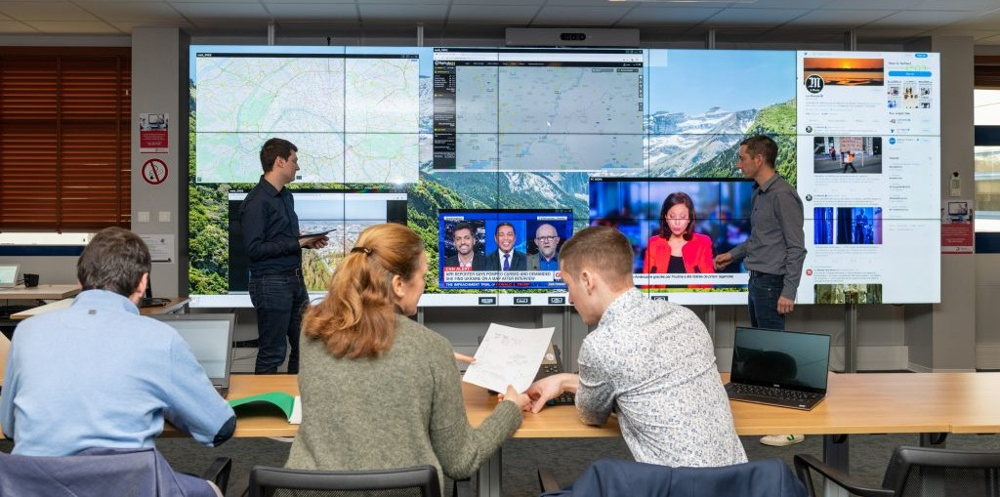
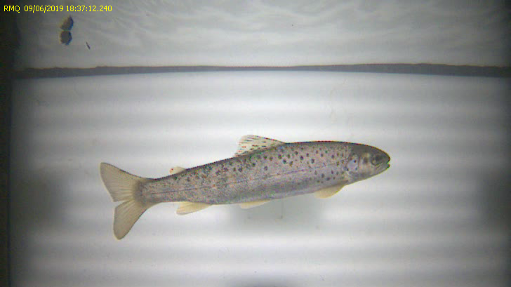
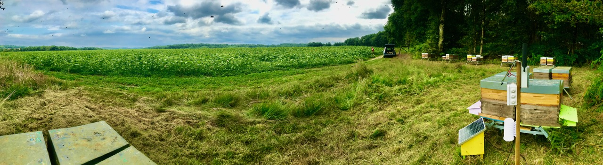
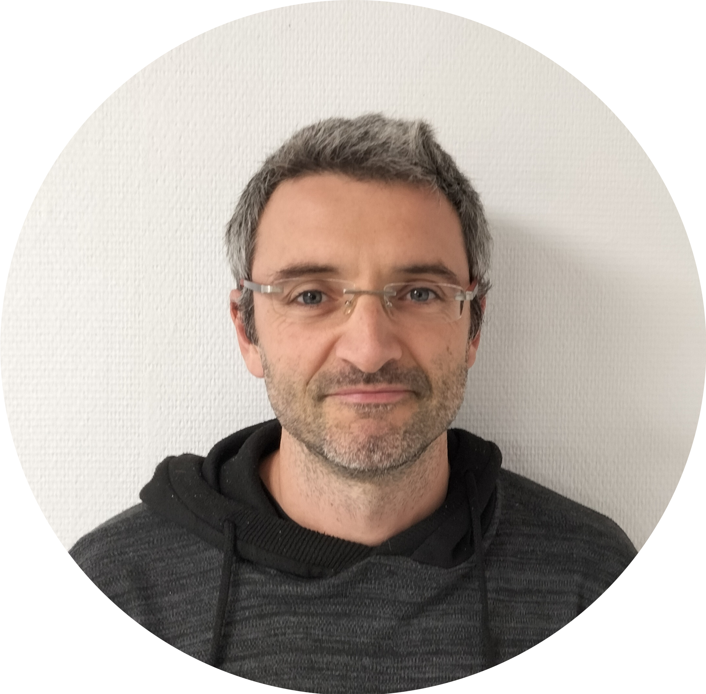
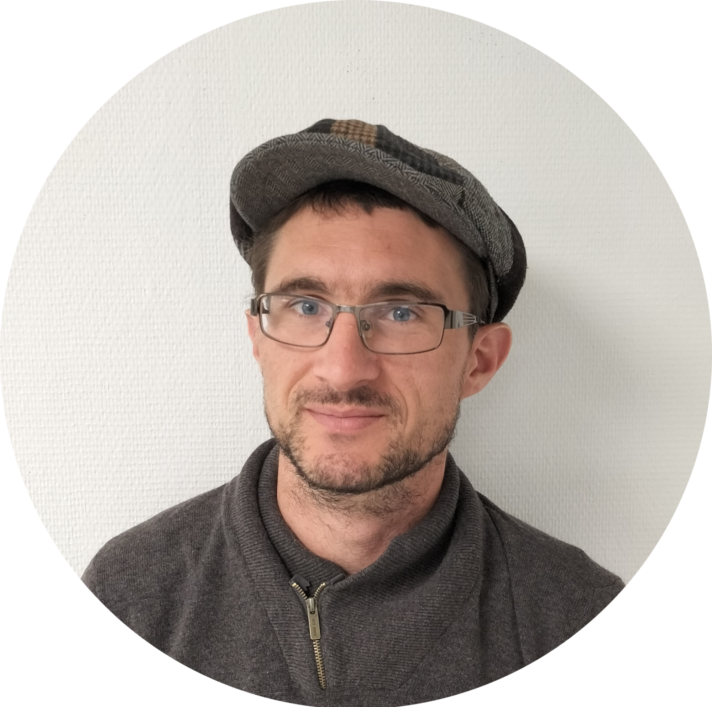
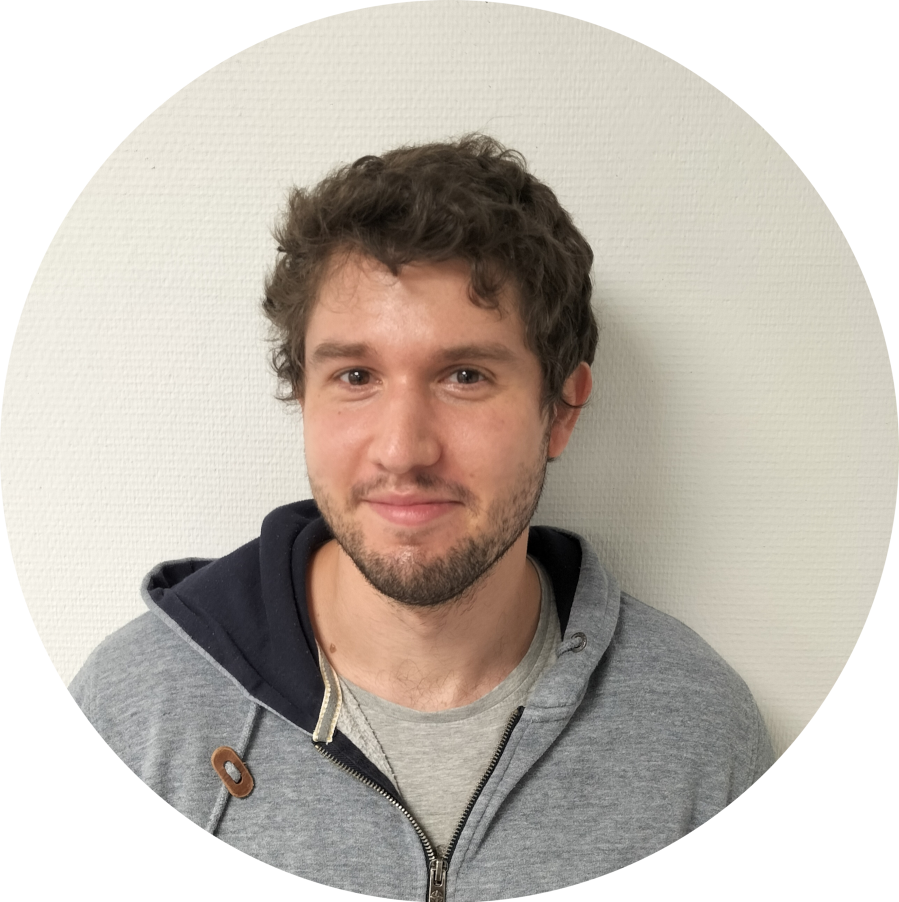

The GreenAi UPPA team is an engaged lab that improves state-of-the-art machine learning algorithms. Concerned with our impact on earth, we develop low consumption algorithms and tackle environmental challenges. Unlike other research groups, our activities are dedicated to the full pipeline from the math grounding to R&D prototype and in production deployment with industrial partners. We are based in Pau, France, in front of the Pyrénées. 

## Our research

{:class="img-responsive"}

Our research encompasses diverse projects and collaborations around the mathematical foundations of power-efficient deep/machine learning algorithms, and the applications of AI to build a more sustainable world. In this section, we present the mathematical as well as the algorithmic part of our activity. 

### Theory and algorithms 

Deep Learning has become extremely popular to solve many supervised machine learning problems. This standardization of machine learning, namely computing on GPU a stochastic gradient descent is not only a plague for science but also a disaster in terms of power consumption. Recently, a growing interest is observed in the deep learning hype in order to reduce computational cost by designing lighter architectures. Several approaches for reducing the computational effort of NNs have been proposed (e.g. binarized networks or pruning methods). Moreover, promising strategies propose to select the connectivity of the network, or more generally the architecture, during the training process. 

 GreenAi UPPA expects to address these issues, based on both a theoretical and practical machine/deep learning analysis of standard pipeline and new paradigms. More precisely, we propose alternatives to standard deep learning pipelines in order to rethink the learning process and show how mathematical statistics could help us to select lighter algorithms and reduce training, inference complexity and environmental impact of machine learning.

**Measure the hungriness of your deep learning**: We measure the power consumption of recent architectures on different hardwares through our [IAPowerMeter](https://github.com/GreenAI-Uppa/deep_learning_power_measure) based on RAPL and nvidia-smi. 

{:class="img-responsive"}

### Upcoming seminars and events

- **Seminar for the Approximate Bayesian Inference Team** [git](https://team-approx-bayes.github.io/), team member, Deep learning theory for power-efficient algorithms.

### Past seminars and events

  

    <b>&#8226; November, 22th 2021 - Sébastien Loustau (UPPA)</b>, team member, Forget SGD - Deep learning theory for a new optimizer
  

  

    <b>Abstract:</b> In this talk, I will introduce alternatives to standard gradient descents to learn power-efficient deep learning algorithms. After a gentle start about optimization with mirror descents,  we present recent theoretical advances on Pac-Bayesian sparse deep learning, leading to a new greedy optimizer to learn sparse and potentially binarized deep networks. We finally introduce new divergences to the prior, and rely this framework with metric task systems.
  

**November, 17th 2021 Workshop at ACML**, Power-Efficient Deep Learning. Organized with [Pierre Alquier](https://pierrealquier.github.io/) from the [Approximate Bayesian Inference Team](https://team-approx-bayes.github.io/) at [Riken Institute](https://www.riken.jp/en/). Details in a dedicated landing page asap.

  

    <b>&#8226; November 8th, 2021 - Jordy Palafox</b>, team member, Adaptive Learning and Clustering methods
  

  

    <b>Abstract:</b> In the context of adaptive learning, clustering methods are used to recognize students with the same profil. Here, we will focus on the clustering algorithm used by Prof en Poche which is a combinaison of two methods : the KMedoids and the Louvain algorithm to obtain a robust method. After introducing it, we will measure the consumption of the algorithm and explore how to reduce it. We will conclude with some recent methods using deep learning based on autoencoders.
  

  

    <b>&#8226; October, 25th 2021 - Paul Gay (UPPA)</b>, team member, Power efficient transformers
  

  

    <b>Abstract:</b> As transformers are becoming the standard NLP tool, questions are raised about ethics, bias and energy consumption. This last topic is of importance as these models are the biggest ones in the large and hungry power deep learning model trend. In this seminar, I will present in the first part a conmprehensive tutorial on the principles of attention and how the transformers have conquered the state of the art. This details will equip us for the second part in which I will survey a number of methods which are concerned in making the transformers lighter and more available for practicionners with low computation resources.

 

<a href="/seminars/sem7.pdf">Slides here</a>

  

    <b>&#8226; October, 11th 2021 - Matthieu François</b>, team member, AI addition to crisis management
  

  

    <b>Abstract:</b> Human impact on our planet is increasing the scale and the number of environmental disasters. During this seminar I'll present our join project with Altanoveo. This project is about AI integration to climate or industrial crisis management methods. I will describe the potential of IA in this domain and present two models on tweet classification and fire detection on natural images.
 
<a href="/seminars/sem6.pdf">Slide here</a>
  

  

    <b>&#8226; September, 27th 2021 - Sébastien Loustau</b>, team member, Introduction to convex optimization
  

  

    <b>Abstract:</b> In this lecture, I will introduce convex optimization theory and mirror descent. We start with a theoretical motivation and studyt of (stochastic) gradient descent, and then moove to the non-euclidean setting to derive mirror descent algorithm as a generalization of gradient descent. We finally apply it to the context of expert advices to recover the classical regret bound for exponential weighted averages previously presented in the first seminar in july, and discuss possible applications to Green AI.
 
<a href="/seminars/sem5.pdf">Slide here</a>
 

  

    <b>&#8226; September, 13th 2021 - Sébastien Loustau</b>, team member, Kick Off GreenAi Uppa
  

  

    <b>Abstract:</b> Official kick off of the GreenAi UPPA project ! After presenting the climatic and mathematical motivations (has the earth ever been this hot before ?), we introduce the context and support we have from the public institutions and the SMEs. We explain how the team will be organized, and inspired from the best of both worlds. Then we take 30 minuts to write our **elevator pitch**. Welcome to Jordy and Matthieu !
 
<a href="/seminars/sem4.pdf">Slide here</a>
  

  

    <b>&#8226; August, 23rd 2021 - Paul Gay</b>, team member, Measuring the Power draw of computers
  

  

    <b>Abstract:</b> The ability of measuring power and consumption of machine learning algorithms is necessary to design new efficient ones. Nowadays, there is a growing interest in the machine learning and IT community for measuring the consumption at different scale, from the AI model to the entire data center. In this talk, we survey recent tools and softwares based on RAPL and NVIDIA-SMI and highlight the dependancy to the hardware considered (CPU, GPU), as well as the different sources of consumption in the architecture of a computer. The final goal is to give to engineers and data scientists the capacity to measure the consumption of deep/machine learning algorithms via our open source software <a href="https://github.com/GreenAI-Uppa/deep_learning_power_measure">deep_learning_power_measure</a> developed by Green AI Uppa.
 
<a href="/seminars/sem3.pdf">Slide here</a>
  

  

    <b>&#8226; July, 26th 2021 - Julien Mercier</b>, team member, How to binarize a neural network 
  

  

    <b>Abstract:</b> In this talk, I propose to present the main pros and cons of binarization via the gradient. We present two main historical attempt: 
    <a href="https://arxiv.org/abs/1511.00363">BinaryConnect</a> and <a href="https://arxiv.org/abs/1602.02830">BinaryNetwork</a>, based on two recent papers.
 
<a href="/seminars/sem2.pdf">Slide here</a>

  

  

    <b>&#8226; July, 5th 2021 - Sébastien Loustau</b>, team member, Comment intégrer des contraintes environnementales dans les algorithmes de Deep Learning 
  

  

    <b>Abstract:</b> Dans cet exposé, je vous propose d'introduire la théorie PAC-Bayesienne et son lien avec la théorie des jeux pour proposer de nouvelles procédures d'apprentissage séquentiel. Après une introduction simple du problème de prévision avec avis d'experts, on présentera des inégalités PAC-Bayesiennes plus générales et des bornes de regrets parcimonieuses pour des famillles de réseaux de neurones particulières (XNOR-nets notamment). Enfin, on proposera une extension de cette théorie au Transport Optimal pour intégrer de nouvelles pénalités plus génériques et garantir l'intégration de mesures de consommations plus précises.
    Cet exposé est une introduction aux principales motivations de ces articles : Learning with BOT et Sparsity regret bounds for XNOR-Nets
    notes manuscrites disponibles ici
  
 
<a href="/seminars/sem1.pdf">Slide here</a>
 
  

### Training

We have a long experience in creating training content on machine learning and deep learning towards student and industrial learners. 

## Industrial projects

We also collaborate with industrial partners to tackle new scientific challenges. These contrats allow to grant new research programs between SMEs and University in one of these two directions: 
 (1) the design of embedded and light AI algorithms or 
 (2) the application of AI for environment purpose.

### Crisis management

[Altanoveo](https://www.cwall.fr/en/) is specialised in very high resolution visualization and has developped for 10 years **CWall**, a high resolution collaborative software solution designed to be deployed on video walls.
CWall is multi-site, multi-source and multi-application. It offers real-time collaboration among people working in the same room or remotely by sharing thier computer screens, video streams,  web application and so on. 
CWall shows its full potential for : 

- joint study of resources at a very high resolution across a wide range of disciplines, 
- simultaneous display of several streams and information into different windows, particularly in crisis management or monitoring situations.

Our main purpose is to integrate AI on Cwall in order to index the vast amount of information encountered crisis.

Based on low consumption algorithms, this project start with an analysis of social networks and open source data as climate crisis images. Being able to summarize open informations and foresee their impact will be a perfect addition upgrade to CWall. 

{:class="img-responsive"}

### AI for Education

The start-up [ProfenPoche](https://profenpoche.com/) was founded in 2015 by Vincent Escudé and Samuel Imbert. 
It is specialized in creation on new numerical educative solutions and more specifically, propose to provide a teacher to a needed student using smartphone, tablet or computer. They also created **Mathia** using AI as a innovative product in order to give them the love of mathematics of primary school children which is based on AI. In 2019, they were rewarded for Mathia as laureate of P2IA (Partenariat d’Innovation en Intelligence Artificielle) launched by the Ministère de l'Education Nationale et de la Jeunesse.

Mathia is an app which recommands educational material to children. The recommendation is powered by a clustering performed on the children profile and which includes their skills and personal difficulties. Our goal is to improve these tasks and reduce the consumption of energies.

### Computer vision and Hydrobiology

[Hizkia Informatique](https://www.hizkia.eu/) is an IT services company. Her experience in computer and video applications for hydrobiology began with INRA (French national institute for agronomic research) more than 15 years ago.
Hizkia designs all its products: hardware and software. It does software development and the installation and maintenance of equipment. Hizkia also has 30 years’ experience in industrial service.

Hizkia has designed a **video-counting device for fish passage**. In the current version, operators have to watch the videos to note the species of fish and their size. Our purpose is to have the videos processed by an AI that would be able to recognize the species of fish, count and measure them automatically. This application of Computer Vision to biodiversity monitoring contains next level challenges : object tracking from frame to frame, denoising images, correct lighting and species labels, and tackle problems of quantization and selection of high resolutions images and videos.

{:class="img-responsive"}

### Improving bee health and pollination

Mellisphera is building data-driven solutions for hive monitoring and pollination management. Founded in 2018, the company offers to beekeepers and growers, tools and algorithms to assess in real time colony health, colony dynamics and pollination activity.

The main benefits of this technology are:
-  Efficient beekeeper’s operations: A constant information stream about the colony health allows for focused actions with the appropriate hardware and at the right time. Savings in time and fuel are significant with a typical ROI < 12 month
-  Lower honeybee mortality rates: A real time alerts system allows beekeepers to be warned when it’s still time for action. We aim reducing mortality from 30% to 10%.
-  Improved pollination and yield: 75% of the fruits we eat are pollinator dependent at some extent. Good pollination is essential for growers achieve yield and quality. Mellisphera monitors pollination on kiwi, sunflower and apple yards. 

Our challenge is to improve beekeeping practices by offering predictive tools that are at the same time accurate and scalable over different regions and countries. To achieve this goal, we are relying on mechanistic and AI powered models. They are developed in our research apiaries as in those from multiple beekeepers contributing around the world. We are partnering with [Broodminder](www.broodminder.com) into a global team with the shared ambition to offer one of the best-in-class solutions.

{:class="img-responsive"}

## Sponsors

This project is mainly supported by the I-Site [E2S-UPPA](https://e2s-uppa.eu/fr/index.html), a french consortium composed of [CNRS](https://www.cnrs.fr/), [INRIA](https://www.inria.fr/), [INRAE](https://www.inrae.fr/) that assists companies and public organizations in their energy and environmental transition.

Partnerships with public institutions, as well as SMEs are one of the main motivations for the existence of GreenAi Uppa. 
 - [AltaNoveo](https://www.cwall.fr/)
 - [Aquitaine Science Transfert](https://www.ast-innovations.com/)
 - [Technopole Hélioparc](https://helioparc.fr/)
 - [Mellisphera](https://www.mellisphera.com/)
 - [ORIE, Cornell University](https://www.orie.cornell.edu/orie)
 - [Prof en Poches](https://profenpoche.com/)
 - [Réseau Francilien en Sciences Informatiques (RFSI)](https://dim-rfsi.fr/)
 - [Hizkia Informatique](https://www.hizkia.eu/)

## Team members

We wish to bring together different people from different communities but with one share commitment: take collective actions on the world's greatest crisis and build a safe and healthy planet for the next generations.

### Sébastien Loustau

After a PHD thesis defended in 2008, at [Institut de Marseille](https://www.i2m.univ-amu.fr) Sebastien worked as Associated professor at [Université d'Angers](https://www.univ-angers.fr/fr/index.html) in the lab [LAREMA](https://math.univ-angers.fr/LAREMA/) where he defended his Habilitation thesis in 2014.
He found the AI start-up [LumeanAI](https://www.lumenai.fr/) in 2015 and the non-profit organization [IAPau](http://www.iapau.fr/) in 2016.
Since 2020, he is researcher at the [LMAP](https://lma-umr5142.univ-pau.fr/fr/index.html) at [Université de Pau et des Pays de l'Adour](https://www.univ-pau.fr/fr/index.html) and created the GreenAi UPPA Group.
His research interest are online learning, mathematical statistics, information theory for machine learning  and more recently, in the applications of these activities to deep learning techniques and environmental challenges. 
For contact, send an email at sebastien[dot]loustau[at]univ-pau.fr

[Web page](https://sebastienloustau.github.io/)

### Paul Gay

Currently researcher at the [LMAP](https://lma-umr5142.univ-pau.fr/fr/index.html), Paul obtained his phd between [LIUM](https://lium.univ-lemans.fr/) in France and  [IDIAP Reshearch Institut](https://www.idiap.ch/en) in Switzerland in 2014 on unsupervised Audio-visual person identification in broadcast data. Then, he went through a teaching period at the [LIA](https://lia.univ-avignon.fr/) (2015) a Post-doc in computer vision, at [IIT/PAVIS](https://pavis.iit.it/) (2016 - 2018), and worked at the [LumenAI](https://www.lumenai.fr/) on community detection (2019 - 2020).
For contact, send an email at paul[dot]gay[at]univ-pau.fr 

[Web page](https://paulgay.github.io/index.html)

### Matthieu Francois

Matthieu obtained his Master's degree in 2020 at [Université de Grenoble Alpes](https://www.univ-grenoble-alpes.fr/). After some experiences as Data Consultant, he joined GreenAi UPPA Team in Septembre 2021.
For contact, send an email at matthieu[dot]francois[at]univ-pau.fr \
[Web page](https://www.linkedin.com/in/matthieufran%C3%A7ois/)

### Jordy Palafox

Jordy defended his Phd Thesis in 2018 at [UPPA](https://www.univ-pau.fr/fr/index.html) [LMAP](https://lma-umr5142.univ-pau.fr/fr/index.html). After a post-doc in 2018-2019 at La Rochelle in the lab [LASIE](https://lasie.univ-larochelle.fr/), he taught at CY Tech two years and followed training in Data Science. He joined GreenAi UPPA group in Septembre 2021.
For contact, send an email at jordy[dot]palafox[at]univ-pau.fr \
[Web page](https://www.linkedin.com/in/jpalafox1242/)

## Contact

Feel free to contact us if you want to contribute: contact [Paul](mailto:paul.gay@univ-pau.fr) or [Sébastien](https://sebastienloustau.github.io)

