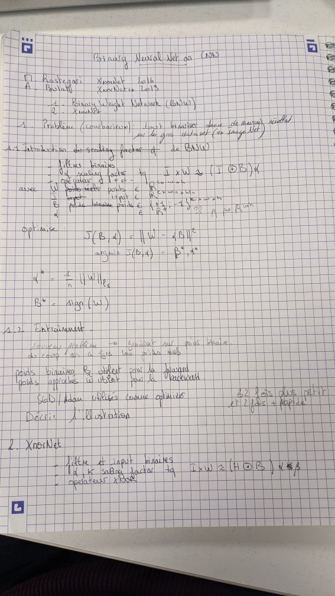
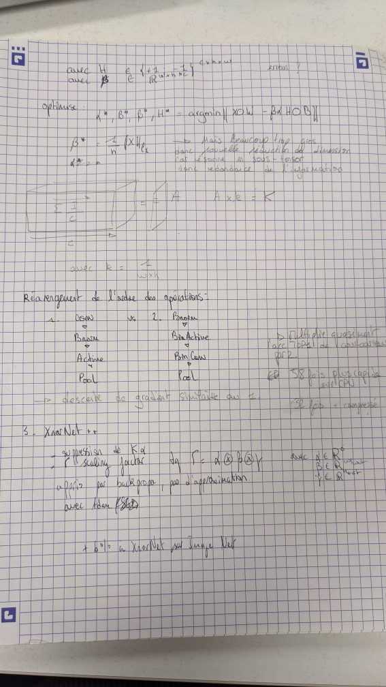

# Reading Group

Every 6 weeks, we have a cycle of reading group where each team member presents two researchs articles.

## Wave 2 : 24/01/22

### Binarization : Fatou Kiné Sow & Matthieu François 

  
  

### About Early Exit : Simon Lebeaud

<a href="/vague-janvier-2022/EarlyExits.pdf">Slides here</a>

For more details, see :
[1] Multi-scale dense networkds for resource efficient image classification
https://arxiv.org/pdf/1703.09844.pdf

[2] SPINN : Synergistic Progressive Inference of Neural Networks over device and cloud :
https://dl.acm.org/doi/pdf/10.1145/3372224.3419194?casa_token=RFxtEQkOZNUAAAAA:21z5vdlEpdRCR2ZJSq8jMeKNlvG8vq8rmOiSe5t5JIzvNiX5W9rV3QznnW4j4KqNyWHUx0tfmSRn8g

### Pruning : Nicolas Tirel & Yanis Chaignaud

[1] M. C. Mozer et P. Smolensky, « Skeletonization: A Technique for Trimming the Fat from a Network via Relevance Assessment », 1988.
See here https://www.semanticscholar.org/paper/Skeletonization%3A-A-Technique-for-Trimming-the-Fat-a-Mozer-Smolensky/a87953825b0bea2a5d52bfccf09d2518295c5053

[2] N. Lee, T. Ajanthan, et P. H. S. Torr, « SNIP: Single-shot Network Pruning based on Connection Sensitivity », arXiv:1810.02340 [cs], févr. 2019, See http://arxiv.org/abs/1810.02340

[3] P. de Jorge, A. Sanyal, H. S. Behl, P. H. S. Torr, G. Rogez, et P. K. Dokania, « Progressive Skeletonization: Trimming more fat from a network at initialization », arXiv:2006.09081 [cs], March 2021, See http://arxiv.org/abs/2006.09081

### Pruning with bugdget : Jordy Palafox

## Wave 1 : 29/10/2021

## Contact

Feel free to contact us if you want to contribute: contact [Paul](mailto:paul.gay@univ-pau.fr) or [Sébastien](https://sebastienloustau.github.io)
